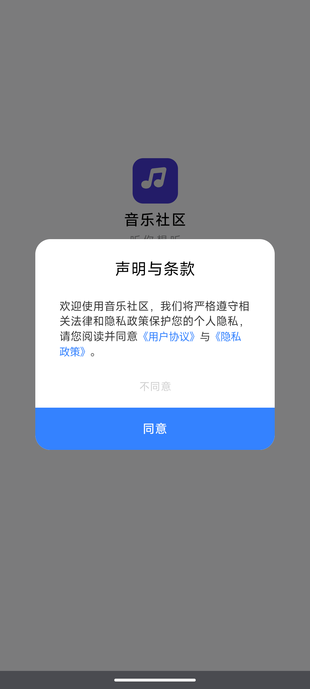
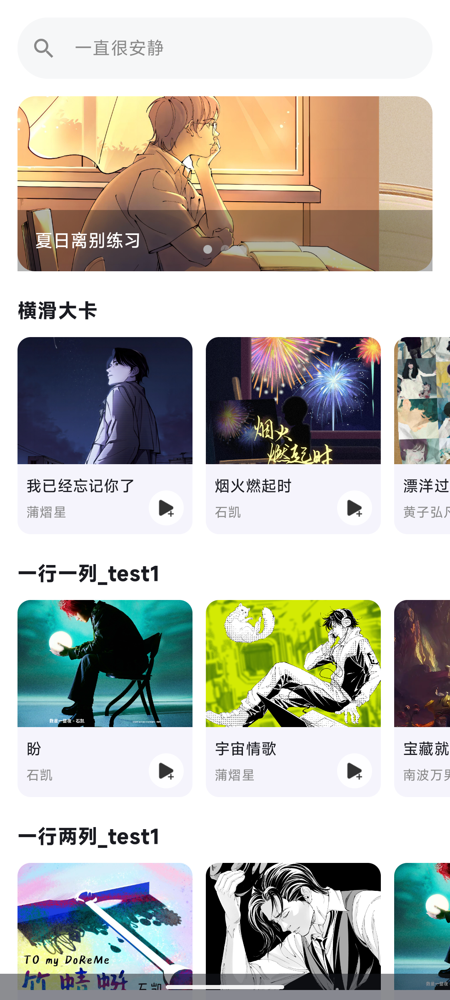
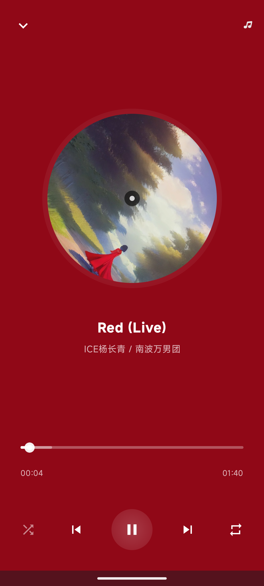
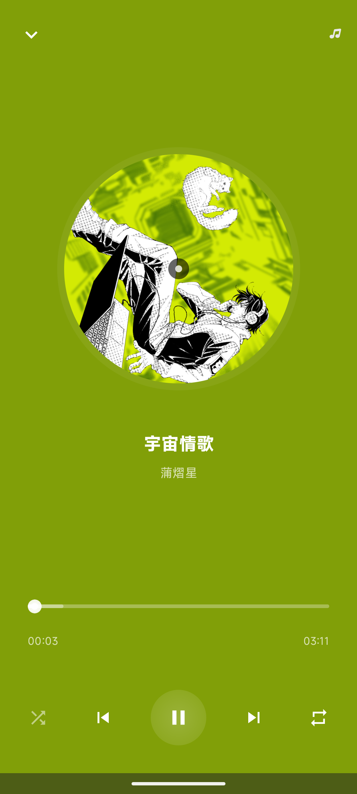
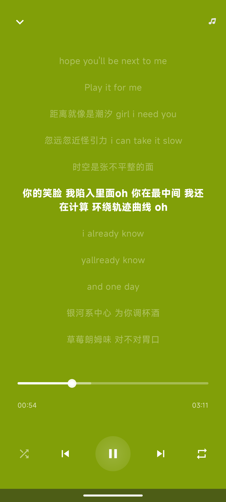
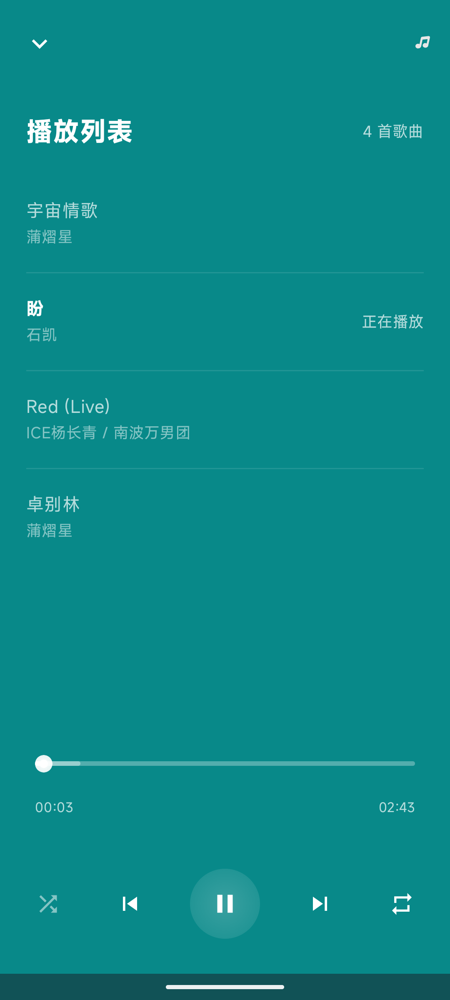
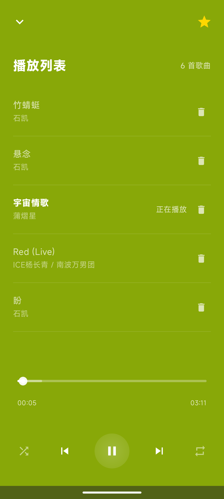
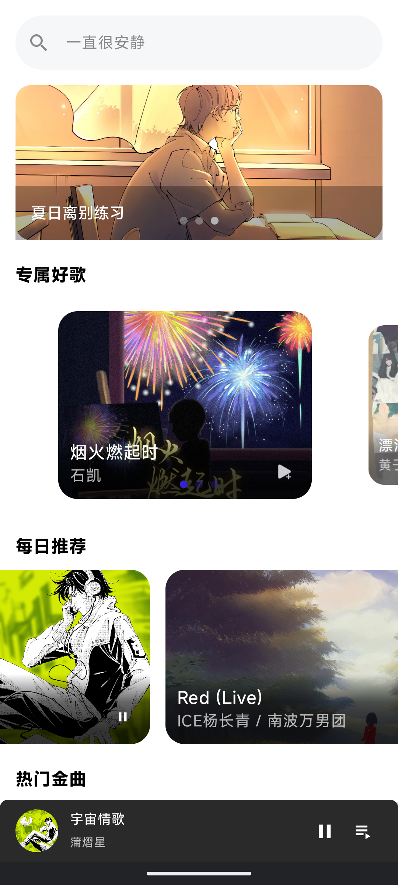
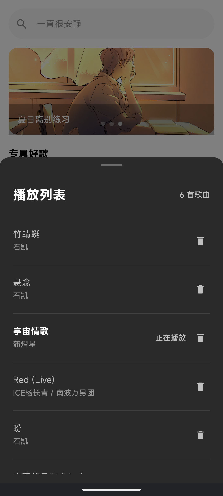

# 音乐社区大项目

## 总览

### UI设计

- 应用全局使用MiSans字体，使界面更加美观现代，符合小米生态设计语言
- 图标设计和界面风格遵循Material Design设计规范
- 主要界面做到尽可能还原设计稿，在细节上独立构思以优化用户体验

### 资源管理机制

1. **MediaPlayer 资源管理**：
   - 在 `MusicPlayer.playTrackAt()` 方法中正确释放旧的 `MediaPlayer` 实例并创建新实例
   - 在应用退出时通过 `releaseCompletely()` 方法完全释放资源
   - 实现了 `resumePlayback()` 方法处理应用从后台恢复时的状态

2. **图片加载缓存**：
   - 通过 `MusicApplication` 实现了 `ImageLoaderFactory`，配置了 Coil 的内存缓存和磁盘缓存
   - 设置了合理的缓存大小（内存25%，磁盘2%）

3. **歌词缓存**：
   - 在 `PlayerViewModel` 中使用 OkHttpClient 的缓存功能，为歌词请求添加了5MB的磁盘缓存

4. **颜色提取缓存**：
   - 实现了背景色缓存机制，避免重复提取封面颜色

5. **应用退出机制**：
   - 在 `MainActivity.onDestroy()` 中检测是否是真正退出（而非配置更改），并释放资源
   - 调用 `MusicApplication.onTerminate()` 确保资源被释放

---

## **项目结构**

```markdown
music_yishuai/
├── app/
│   ├── build.gradle.kts
│   ├── src/
│   │   ├── main/
│   │   │   ├── AndroidManifest.xml
│   │   │   ├── java/
│   │   │   │   └── com/
│   │   │   │       └── example/
│   │   │   │           └── music_yishuai/
│   │   │   │               ├── components/
│   │   │   │               │   └── TermsAndConditions.kt  # 用户协议和隐私政策组件
│   │   │   │               ├── data/
│   │   │   │               │   ├── UserPreferences.kt  # 用户偏好数据类
│   │   │   │               │   └── model/
│   │   │   │               │       └── MusicModels.kt  # 歌曲和播放列表数据模型
│   │   │   │               ├── network/
│   │   │   │               │   └── NetworkClient.kt  # 网络请求客户端
│   │   │   │               ├── player/
│   │   │   │               │   └── MusicPlayer.kt  # 音乐播放器核心逻辑
│   │   │   │               ├── ui/
│   │   │   │               │   ├── components/
│   │   │   │               │   │   ├── player/
│   │   │   │               │   │   │   ├── LyricsView.kt  # 歌词显示组件
│   │   │   │               │   │   │   ├── MiniPlayerBar.kt  # 迷你播放器栏
│   │   │   │               │   │   │   └── PlaylistView.kt  # 播放列表组件
│   │   │   │               │   │   └── SongCard.kt  # 音乐卡片组件
│   │   │   │               │   ├── screens/
│   │   │   │               │   │   ├── HomeScreen.kt  # 主页界面
│   │   │   │               │   │   └── PlayerScreen.kt  # 播放器界面
│   │   │   │               │   └── viewmodels/
│   │   │   │               │       ├── HomeViewModel.kt  # 主页 ViewModel
│   │   │   │               │       └── PlayerViewModel.kt  # 播放器 ViewModel
│   │   │   │               └── ...
│   │   │   └── res/
│   │   │       ├── drawable/
│   │   │       │   └── ic_arrow_down.xml  # 向下箭头图标资源
│   │   │       ├── font/
│   │   │       │   └── mi_sans_regular.ttf  # 字体资源
│   │   │       └── ...
│   │   └── ...
│   └── ...
├── build.gradle.kts
└── settings.gradle.kts
```

---

## Day1阶段工作

实现了以下功能：

1. **用户协议和隐私政策**：
   - 在 `TermsAndConditions` 组件中，用户可以阅读并同意用户协议和隐私政策。
   - 用户可以点击链接查看详细的用户协议和隐私政策。
   - 用户可以选择同意或不同意条款，并保存用户的选择。

2. **主页数据加载**：
   - 在 `HomeViewModel` 中，通过网络请求加载主页数据。
   - 使用 `ViewModel` 和 `viewModelScope` 进行数据加载和状态管理。
   - 处理加载状态和错误信息。

3. **主页界面展示**：
   - 在 `HomeScreen` 组件中，使用 `LazyColumn` 显示主页内容。
   - 包含搜索栏、横幅（Banner）展示、横滑大卡和音乐列表等模块。
   - 使用 `HorizontalPager` 实现横幅的自动轮播。

4. **搜索功能**：
   - 在 `SearchBar` 组件中，用户可以输入搜索内容并执行搜索操作。

5. **音乐卡片展示**：
   - 在 `SongCard` 组件中，展示音乐封面、名称和作者信息。
   
   - 添加播放图标，用户可以点击播放音乐（目前点击事件尚未实现具体功能）。
   
     
   
     
   
     

---

# Day2阶段工作

1. **播放器核心相关**：
   - 在 `PlayerViewModel` 中，处理了歌词的加载和解析，包括网络请求和本地测试歌词的使用。
   
   - 实现了 `onCompletion` 方法，用于处理歌曲播放完成后的操作。
   
   - 实现了 `getCurrentLyricIndex` 方法，用于获取当前歌词行索引。
   
   - 实现了播放、暂停、上一首、下一首、随机播放和单曲循环的功能
   
     
   
2. **播放器界面**：
   - 在 `PlayerScreen` 组件中，用户可以左右滑动查看当前播放的音乐信息、歌词和播放列表。
   
   - 实现了开启关闭播放器页面上拉下拉的动画。

   - 当播放列表为空时显示加载指示器。
   
     
   
3. **歌词**：
   - 在 `PlayerViewModel` 中，处理了歌词的加载和解析，包括网络请求和本地测试歌词的使用。
   
   - 使用 `LyricParser` 解析歌词内容，并更新歌词状态。
   
     
   
4. **播放列表**：
   - 在 `MusicModels.kt` 中，定义了 `Song` 和 `Playlist` 数据类，用于表示歌曲和播放列表。

     
   
5. **主页**
   
   - 补充完善了昨天未完成的下拉刷新功能
   


---

# Day3阶段工作


1. **首页悬浮View**：
   - 在 `HomeScreen` 中实现了音乐播放页关闭后返回首页时显示悬浮View，展示当前音乐和对应状态。
   - 首次打开App时，随机选择某个模块的音乐播放，并显示悬浮View，同时将当前模块所有音乐添加到音乐列表数据源中。

2. **音乐播放页**：
   - 在 `PlayerScreen` 中实现了点击音乐列表按钮弹出音乐列表弹窗。
   
   - 实现了收藏功能，仅更新本地状态，状态保存在本地。
     - 点击收藏时，图标由1.0放大到1.2倍，然后回到1.0倍，同时图标沿Y轴旋转360度，持续时间1000ms。
     
     - 点击取消收藏时，图标由1.0缩小到0.8倍，然后回到1.0倍，持续时间1000ms。
     
       
     
   - 实现了页面滑动关闭功能。
   
3. **首页悬浮View**：
   - 包含歌曲图片、音乐名称、歌手名称、暂停/播放按钮、音乐播放列表按钮。
   
   - 点击播放/暂停按钮时，音乐播放时点击暂停播放，音乐暂停时点击播放。
   
   - 点击音乐播放列表按钮时，打开音乐播放列表页面。
   
   - 切换到后台时，音乐能够正常播放。
   
   - 悬浮View底部增加播放进度条，支持拖动，并与播放页切换时进度保持同步。
   
   - 点击首页悬浮View时，跳转到音乐播放页，启动过程中有动画，页面从底部向上划入。
   
     
   
4. **音乐列表弹窗**：
   - 包含标题和顶部列表音乐数量、音乐列表。
   
   - 音乐列表包含音乐名称、删除按钮、歌手名称。
     - 点击删除按钮时，将当前数据从列表中删除，并更新列表音乐总数量。
     
     - 如果删除当前播放音乐：
       - 如果删除后播放列表为空，则直接关闭播放列表，返回首页，隐藏首页悬浮View。
       - 顺序模式、单曲循环：直接播放下一首音乐，如果当前音乐是最后一首，自动播放第一首音乐。
       - 随机模式：随机播放下一首音乐。
       
     - 点击当前Item时，播放当前音乐。
     
     - 音乐列表数据源：
       - 点击Item时，跳转到音乐播放页，播放当前歌曲，并将当前模块音乐按顺序添加到音乐播放列表中。
       
       - 每个Item有个+号，点击将当前音乐添加到播放列表中。
       
       - 当前歌曲已经在列表中存在时，歌曲不重复加入到列表中。
       
   
   

---

# **项目整体联调阶段工作**

## 分析潜在问题

1. **缺少生命周期管理**：

   - 未发现 `MainActivity` 中对 `onPause()` 和 `onResume()` 的实现，这可能导致应用切入后台时未能正确处理媒体播放状态

2. **OkHttpClient 实例管理**：

   - 在 `PlayerViewModel` 和 `NetworkClient` 中都创建了独立的 OkHttpClient 实例，没有共享使用
   - 没有明确的 OkHttpClient 实例释放机制

3. **协程作业管理**：

   - 在 `LaunchedEffect` 和 `viewModelScope.launch` 中启动的协程作业可能没有被正确取消或跟踪

4. **图片加载资源**：

   - `ImageLoader` 实例在 `PlayerScreen` 中直接创建而非通过 MusicApplication 获取：

     ```kotlin
     val loader = ImageLoader(context)
     ```
## 改进

1. **添加生命周期管理**：
   - 在 MainActivity 中实现 onPause 和 onResume 方法，处理应用切换到后台的情况：

```kotlin
override fun onPause() {
    super.onPause()
    // 暂停进度更新，但不停止播放
    val musicPlayer = (application as MusicApplication).getMusicPlayer(application as Application)
    musicPlayer.pauseProgressUpdate()
    println("MainActivity: 应用进入后台，暂停进度更新")
}

override fun onResume() {
    super.onResume()
    // 恢复进度更新和播放状态
    val musicPlayer = (application as MusicApplication).getMusicPlayer(application as Application)
    musicPlayer.resumePlayback()
    println("MainActivity: 应用恢复前台，恢复进度更新")
}
```

2. **统一 OkHttpClient 管理**：
   - 将 OkHttpClient 实例移至 MusicApplication，提供全局单例方法：

```kotlin
class MusicApplication : Application(), ImageLoaderFactory {
    companion object {
        private var musicPlayer: MusicPlayer? = null
        private var okHttpClient: OkHttpClient? = null
        
        fun getMusicPlayer(context: Application): MusicPlayer {
            if (musicPlayer == null) {
                musicPlayer = MusicPlayer(context)
            }
            return musicPlayer!!
        }
        
        fun getOkHttpClient(context: Application): OkHttpClient {
            if (okHttpClient == null) {
                okHttpClient = OkHttpClient.Builder()
                    .connectTimeout(15, TimeUnit.SECONDS)
                    .readTimeout(15, TimeUnit.SECONDS)
                    .cache(Cache(context.cacheDir.resolve("http_cache"), 20 * 1024 * 1024)) // 20MB
                    .build()
            }
            return okHttpClient!!
        }
    }
    
    override fun onTerminate() {
        super.onTerminate()
        // 应用退出时释放资源
        musicPlayer?.releaseCompletely()
        okHttpClient?.dispatcher?.executorService?.shutdown()
        okHttpClient?.connectionPool?.evictAll()
        println("应用退出，完全释放所有资源")
    }
}
```

3. **优化协程作业管理**：
   - 在 ViewModel 中跟踪并取消长时间运行的协程作业：

```kotlin
class PlayerViewModel(application: Application) : AndroidViewModel(application) {
    // 用于保存需要手动管理的协程作业
    private val jobs = mutableListOf<Job>()
    
    // 添加协程作业到管理列表
    private fun addJob(job: Job) {
        jobs.add(job)
    }
    
    // 在 ViewModel 被清除时取消所有作业
    override fun onCleared() {
        super.onCleared()
        jobs.forEach { it.cancel() }
        jobs.clear()
        println("PlayerViewModel: 取消所有协程作业")
    }
    
    // 加载歌词并跟踪作业
    private fun loadLyrics(song: Song): Job {
        val job = viewModelScope.launch {
            // 原有的歌词加载逻辑
        }
        addJob(job)
        return job
    }
}
```

4. **使用应用级 ImageLoader**：
   - 在需要加载图片的地方使用应用级 ImageLoader 实例：

```kotlin
val context = LocalContext.current
val imageLoader = remember {
    (context.applicationContext as MusicApplication).newImageLoader()
}

// 使用应用级 ImageLoader 加载图片
val request = ImageRequest.Builder(context)
    .data(currentCoverUrl)
    .allowHardware(false)
    .build()
val result = imageLoader.execute(request)
```

5. **在 PlayerViewModel 中清理资源**：
   - 优化 `onCleared` 方法，释放不再需要的资源：

```kotlin
override fun onCleared() {
    super.onCleared()
    // 清理缓存和临时资源
    lyricsCache.clear()
    
    // 不再释放 MusicPlayer 资源，因为它在应用级别管理
    println("PlayerViewModel: onCleared(), 清理了临时资源和缓存")
}
```

这些改进有助于更好地管理资源，减少内存泄漏风险，并确保在不同生命周期阶段正确处理媒体播放状态，进一步提高了应用的稳定性和性能。


---

### **提交信息**

**提交人**：易率  

**完成时间**：2025年3月31日  

---

